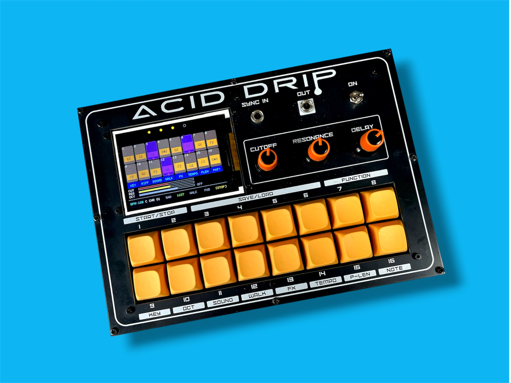
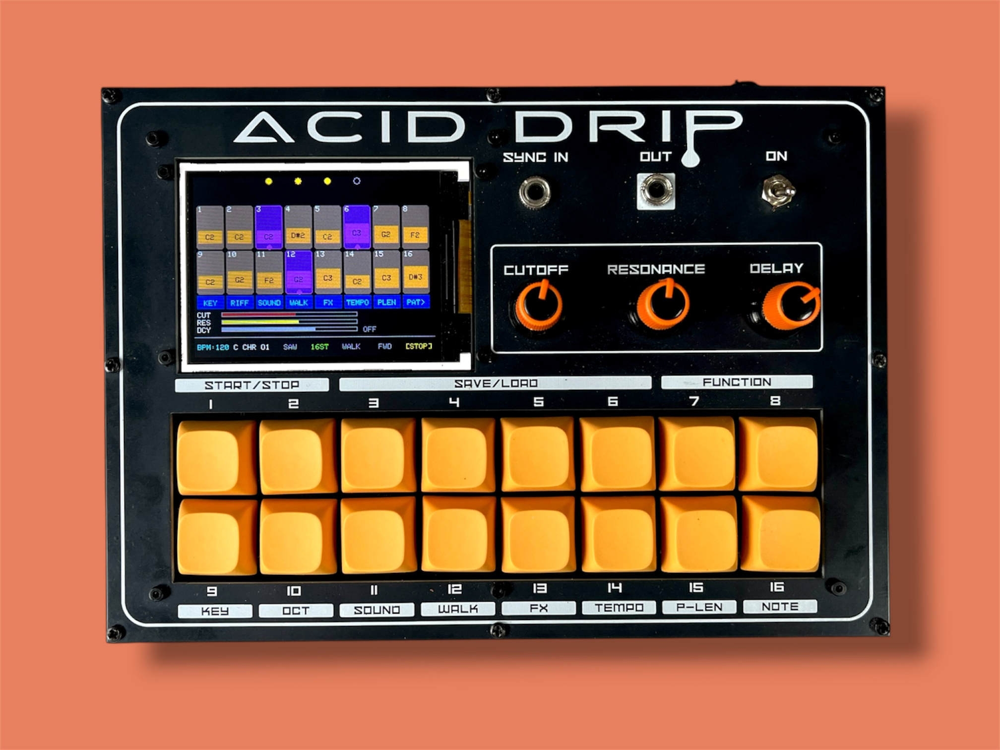
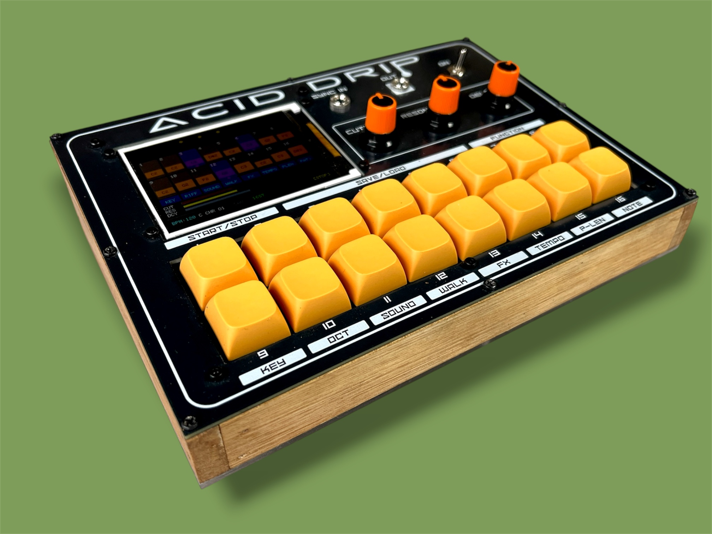

# Acid Drip Bassline Synth & Drum Machine

Youtube Video (click the image) - [](https://youtu.be/anotb2mvv04) 


An RP2040-based acid bassline synthesizer and drum machine built on the Mozzi audio library. Two instruments in one device, a 16-step acid sequencer and a 16-pattern drum groove box running simultaneously on dual cores with a 320×240 ILI9341 TFT display and 16 Cherry MX pads.

  

<p align="center">
  
  &nbsp;
  
  &nbsp;
  
</p>

---

## Hardware

| Component | Detail |
|-----------|--------|
| MCU | RP2040 (Raspberry Pi Pico or equivalent) |
| Display | ILI9341 320×240 TFT |
| Pads | 16× Cherry MX switches (2 rows of 8) |
| Pots | 3× analog (CUT, RES, DECAY) |
| Audio out (acid) | GP15 → 100Ω + 10nF RC filter → 3.5mm jack |
| Audio out (drums) | GP2 → 470Ω resistor → 3.5mm jack |
| Sync in | GP2 (hardware SPDT switch selects drum audio OR sync input) |


### Wiring

```
TFT   : SCK=GP6  SDA=GP7  RST=GP8  DC=GP10  CS=GP13
Pots  : CUT=GP26  RES=GP28  DCY=GP27
Sync  : IN=GP2
Audio : Acid=GP15   Drums=GP2

Top row pads (steps 1–8):
  GP14=pad1  GP12=pad2  GP11=pad3  GP16=pad4
  GP17=pad5  GP19=pad6  GP20=pad7  GP21=pad8

Bottom row pads (steps 9–16 / FUNC select):
  GP0=pad9   GP1=pad10  GP3=pad11  GP4=pad12
  GP5=pad13  GP9=pad14  GP18=pad15 GP22=pad16
```

---

## Dependencies

Install via Arduino Library Manager:

- **Mozzi** (audio synthesis engine)
- **Adafruit GFX**
- **Adafruit ILI9341**

Board package: **Raspberry Pi Pico/RP2040** (Earle Philhower core)

---

## Files

| File | Description |
|------|-------------|
| `Acid_Drip_V4.ino` | Main sketch — acid synth engine, sequencer, UI |
| `BeatMachine2.ino` | Drum machine tab — DrumKid engine, 8 instruments |
| `beats.h` | 16 preset drum patterns (techno, house, hip-hop, etc.) |
| `sample0–7.h` | Drum samples stored as int8 arrays in flash (PROGMEM) |

---

## Acid Synthesizer

### Pad Layout

```
┌─────┬─────┬─────┬─────┬─────┬─────┬──────┬──────┐
│  1  │  2  │  3  │  4  │  5  │  6  │  7   │  8   │
│step │step │step │step │step │step │step  │step  │
│  1  │  2  │  3  │  4  │  5  │  6  │  7   │  8   │
├─────┼─────┼─────┼─────┼─────┼─────┼──────┼──────┤
│  9  │ 10  │ 11  │ 12  │ 13  │ 14  │  15  │  16  │
│KEY  │RIFF │SOUND│WALK │ FX  │TEMPO│PLEN  │PAT>  │
└─────┴─────┴─────┴─────┴─────┴─────┴──────┴──────┘
  (bottom row labels show only in FUNC mode)
```

### Step Editing

| Action | Result |
|--------|--------|
| Short press a pad | Toggle step on/off |
| Long press ×1 | Toggle accent |
| Long press ×2 | Toggle glide |
| Hold pad + turn CUT pot | Set step note (scale-quantised) |

### Chords

| Chord | Action |
|-------|--------|
| Pads 1+2 | Play / Stop |
| Pads 1+2 (hold 2s) | Factory reset |
| Pads 7+8 | Enter / exit FUNC mode |
| Pads 9+10 | Switch between acid synth and drum machine |
| Pads 11+12+13+14 (hold 1s) | Toggle Acid Walks easter egg |
| Pads 15+16 (hold 1s) | Toggle Accent Edit mode |

### Save / Load (hold pads 7+8)

- **Tap** pads 3/4/5/6 → load from slot 1/2/3/4
- **Hold** pads 3/4/5/6 for 1 second → save to slot 1/2/3/4
- Slot status shown top-right (yellow dot = saved, grey = empty)

### FUNC Mode (enter with pads 7+8)

| Pad | Function | Options |
|-----|----------|---------|
| 9 | KEY | Root note: C D Eb F G Ab Bb B |
| 10 | RIFF | Load preset riff pattern: DFLT / SQNCE / FUNK / MINI / JUMP / RAVE / SYNC / DARK |
| 11 | SOUND | Synth voice: SAW / SQR / SINE / PWM / CSAW / CSQR / CSIN / SUBSQ |
| 12 | WALK | Note walk: OFF / 4TH / OCTWAVE / 5TH / BOUNCE / MIN3RD / VAMP3 / RANDOM |
| 13 | FX | Enter FX assign sub-mode |
| 14 | TEMPO | Preset BPM: 100/110/120/128/133/138/145/160 — or tap repeatedly for tap tempo |
| 15 | PLEN | Pattern length: 1 / 2 / 3 / 4 / 6 / 8 / 12 / 16 |
| 16 | PAT> | Playback order: FWD / CW / ALT / REV / SKIP2 / SKIP3 / PING / RND |

> Note: there is currently no live scale-type or octave selector — `seq.scale`/`seq.octave` are only set when loading a saved patch slot.

### FX Assign (FUNC → pad 13)

1. Press a top-row pad to select an effect:
   `None / Oct Up / Retrigger / Stutter / Maj Step / Min Step / Dom7 Step / Dim Step`
2. Press any pad 1–16 to assign that effect to that step.
3. Tap the selected FX pad again to deselect.
4. Long-hold pad 1 to clear all step effects.
5. Pads 7+8 to exit back to main screen.

### Accent Edit

Hold **pads 15+16** for 1 second to enter Accent Edit mode. The three pots are repurposed to tune the accent envelope itself rather than the live filter:

| Pot | Function |
|-----|----------|
| CUT | Accent peak cutoff boost (brightness added on accented steps) |
| RES | Accent peak resonance boost |
| DCY | Accent envelope decay-time multiplier |

Normal CUT/RES/DCY values freeze at their last setting while tuning, so the bassline's base tone doesn't change — only accented steps reflect the new values, live, as you turn the pots. Hold pads 15+16 again to exit; the tuned values are saved to EEPROM automatically and persist across power cycles until changed again.

### Acid Walks (Easter Egg)

Hold **pads 11+12+13+14** for 1 second to toggle a hidden mode with 8 preset patterns inspired by classic acid/house tracks, each pre-loaded with its own key, tempo, length and sound. Select a pattern with pads 1–8. FUNC mode, FX assignment and drum mode all continue to work normally while active. Hold the same 4-pad chord again to exit.

---

## Beat Machine

Switch between acid and drum mode by pressing **pads 9+10 simultaneously**. The sequencer state is preserved when switching.

### Drum Instruments (8 tracks)

| Pad | Instrument |
|-----|-----------|
| 1 | Kick |
| 2 | Hi-hat (closed) |
| 3 | Snare |
| 4 | Rim |
| 5 | Tom |
| 6 | Bass 2 |
| 7 | Clap |
| 8 | Open hat |

### Per-Drum Editing

Hold any drum pad (1–8) and turn the pots:
- **CUT** → pitch (playback speed)
- **RES** → crop / sample length
- **DCY** → volume

Pot pickup prevents value jumps when grabbing a control. Per-drum settings reset on pattern change and are saved with slots.

### Beat Machine FUNC Mode (pads 7+8)

| Label | Function |
|-------|----------|
| PTCH | Global pitch multiplier |
| CRSH | Bit crush depth |
| CROP | Global decay scale (shortens/lengthens all drum decays together) |
| DROP | Mute combos (randomised dropout) |
| HMNZ | Velocity humanize |
| TMPO | Tempo (independent of acid tempo; also drives the acid clock when synced) |
| ACNT | Accent depth |
| STEP | Drum step divider — fires every Nth acid step (e.g. 2 = half time) |

### Preset Patterns

16 patterns selectable from the grid — BASIC, HOUSE, TECHNO, ACIDTRK, HSOC, FUNKY, SWING, BREAKBT, MINML, LATIN, PACIFIC, BLUMND, DNBTEC, VOODOO, GBLDWN, JACK.

---

## Sync In / Drum Mode (GP2)

GP2 is shared between drum audio output and external sync clock input. A physical **SPDT switch on the PCB** routes the pin to either function.

**Boot detection selects the mode:**

- **Drum mode (default):** GP2 is claimed by PWMAudio DMA and outputs drum audio. Switch in the DRUMS position.
- **Sync In mode:** Hold **pad 14** at power-on. GP2 is configured as a digital input and listens for an external clock pulse. Switch in the SYNC position.

A cyan "SYNC IN ACTIVE" message is shown briefly after boot when sync mode is detected. There is currently no equivalent on-screen confirmation for the default drum-mode boot path.

> The switch position and held pad must match. If the switch is in SYNC position but the device boots into drum mode, GP2 will try to drive audio into the sync signal line.

---

## Architecture Notes

The firmware runs on both RP2040 cores:

- **Core 0** — Mozzi audio engine (acid synthesis + drum mixing), pad scanning, sequencer logic
- **Core 1** — TFT display rendering, drum sample buffer filling (via `bmFillDrumBuffer`)

The two cores communicate via the RP2040 inter-core FIFO. All SPI/TFT calls happen exclusively on core 1.

---

## Credits

- Acid synthesis engine adapted from *Badass Bass*  https://www.youtube.com/watch?v=MvDILHYImc4
- Drum engine ported from **DrumKid** by Matt Bradshaw  https://www.youtube.com/watch?v=509iZGjnVhM
- Built with the [Mozzi](https://sensorium.github.io/Mozzi/) audio library
- Hardware design and firmware by Marcus ([lonesoulsurfer](https://github.com/lonesoulsurfer))
