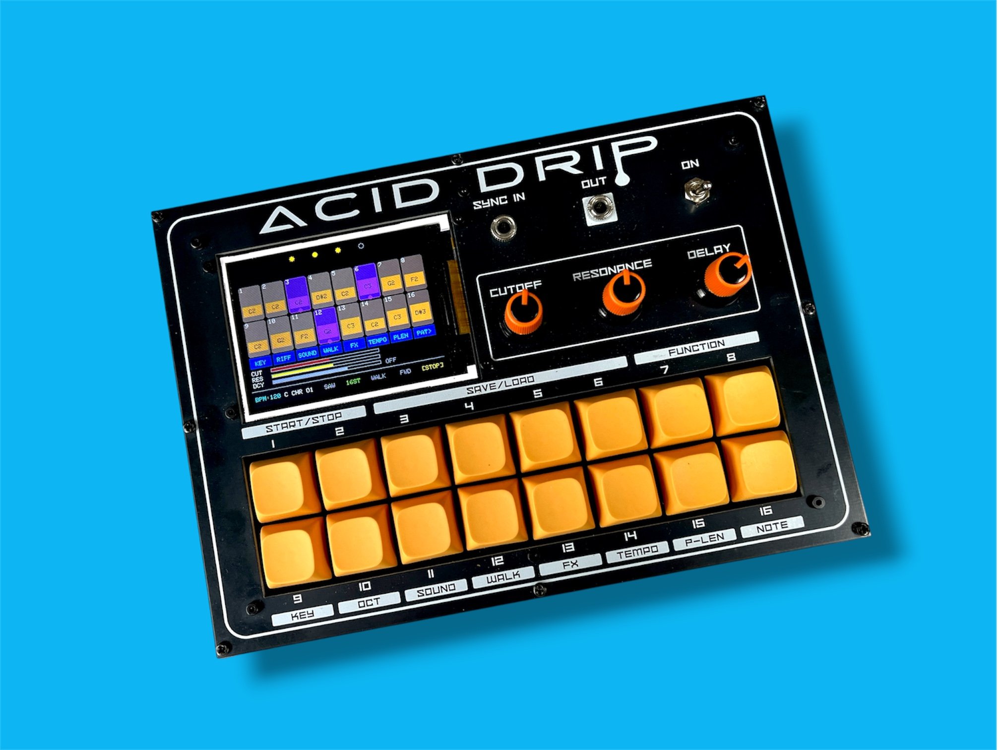
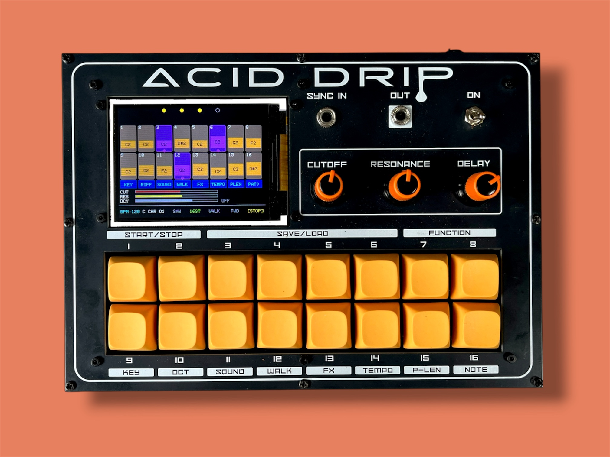
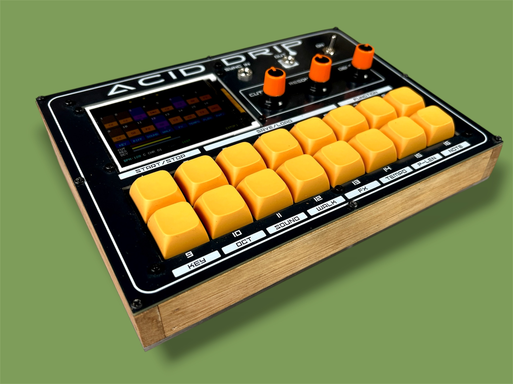

# Acid Drip - Bassline Synth, Drift Synth & Drum Machine

Youtube Video (click the image) - [](https://youtu.be/anotb2mvv04) 


An RP2040-based acid bassline synthesizer and drum machine built on the Mozzi audio library. Three instruments in one device: a 16-step acid sequencer, a second synth voice called DRIFT, and a 16-pattern drum groove box, all running simultaneously on dual cores with a 320x240 ILI9341 TFT display and 16 Cherry MX pads.

NOTE: the images of the synth are V1. V2 is what I have provided in this repo and looks a little different (extra pot for mix added).

NOTE: V5 firmware adds a second synth voice called DRIFT, pattern chaining for the acid save slots, a MIX EDIT mode for balancing all three engines against each other, and a user editable custom drum pattern, on top of everything V4 had. See DRIFT Synth, Pattern Chaining, MIX EDIT and Custom Pattern below for each.

<p align="center">
  
  &nbsp;
  
  &nbsp;
  
</p>

---

## Hardware

| Component | Detail |
|-----------|--------|
| MCU | RP2040 (Raspberry Pi Pico or equivalent) |
| Display | ILI9341 320x240 TFT |
| Pads | 16x Cherry MX switches (2 rows of 8) |
| Pots | 3x analog (CUT, RES, DECAY) |
| Audio out (acid) | GP15 -> 100R + 10nF RC filter -> 3.5mm jack |
| Audio out (drums) | GP2 -> 470R resistor -> 3.5mm jack. In V5 this output also carries the DRIFT synth voice, summed with the drums |
| Sync in/out | GP2 (hardware SPDT switch selects drum/DRIFT audio OR sync). Direction (in or out) is chosen from an on-screen menu at boot, see Sync In/Out below |


### Wiring

```
TFT   : SCK=GP6  SDA=GP7  RST=GP8  DC=GP10  CS=GP13
Pots  : CUT=GP26  RES=GP28  DCY=GP27
Sync  : IN/OUT=GP2
Audio : Acid=GP15   Drums/DRIFT=GP2

Top row pads (steps 1-8):
  GP14=pad1  GP12=pad2  GP11=pad3  GP16=pad4
  GP17=pad5  GP19=pad6  GP20=pad7  GP21=pad8

Bottom row pads (steps 9-16 / FUNC select):
  GP0=pad9   GP1=pad10  GP3=pad11  GP4=pad12
  GP5=pad13  GP9=pad14  GP18=pad15 GP22=pad16
```

---

## Dependencies

Install via Arduino Library Manager:

- **Mozzi** (audio synthesis engine)
- **Adafruit GFX**
- **Adafruit ILI9341**

Board package: **Raspberry Pi Pico/RP2040** (Earle Philhower core)

---

## Files

This repo has two firmware versions, each in its own folder. They are separate sketches, not meant to be merged.

### V4 (`Acid_Drip_V4_Drum_Acid`)

| File | Description |
|------|-------------|
| `Acid_Drip_V4.ino` | Main sketch, acid synth engine, sequencer, UI |
| `BeatMachine_V4.ino` | Drum machine tab, DrumKid engine, 8 instruments |
| `beats.h` | 16 preset drum patterns (techno, house, hip-hop, etc.) |
| `sample0-7.h` | Drum samples stored as int8 arrays in flash (PROGMEM) |

### V5 (`Acid_Drip_V5_Drum_Acid_Drift`)

| File | Description |
|------|-------------|
| `Acid_Drip_V5_Drum_Acid_Drift.ino` | Main sketch, acid synth engine, sequencer, UI, MIX EDIT |
| `Drift.ino` | DRIFT tab, the second synth voice engine |
| `BeatMachine2.ino` | Drum machine tab, DrumKid engine, 8 instruments, custom pattern editor |
| `beats.h` | 16 drum patterns: 15 fixed presets plus one user editable CUSTOM slot |
| `sample0-7.h` | Drum samples stored as int8 arrays in flash (PROGMEM) |

V5 adds a second synth voice (DRIFT), pattern chaining, per engine level mixing (MIX EDIT), and a user editable custom drum pattern, all on top of everything V4 already had. Pick whichever folder matches the firmware you want to flash.

---

## Acid Synthesizer

### Pad Layout

```
+---------+---------+---------+---------+---------+---------+---------+---------+
|    1    |    2    |    3    |    4    |    5    |    6    |    7    |    8    |
|  step   |  step   |  step   |  step   |  step   |  step   |  step   |  step   |
|    1    |    2    |    3    |    4    |    5    |    6    |    7    |    8    |
+---------+---------+---------+---------+---------+---------+---------+---------+
|    9    |   10    |   11    |   12    |   13    |   14    |   15    |   16    |
|   KEY   |  RIFF   |  SOUND  |  WALK   |   FX    |  TEMPO  |  PLEN   |  PAT>  |
+---------+---------+---------+---------+---------+---------+---------+---------+
  (bottom row labels show only in FUNC mode)
```

### Step Editing

| Action | Result |
|--------|--------|
| Short press a pad | Toggle step on/off |
| Long press x1 | Toggle accent |
| Long press x2 | Toggle glide |
| Hold pad + turn CUT pot | Set step note (scale-quantised) |

### Chords

| Chord | Action |
|-------|--------|
| Pads 1+2 | Play / Stop |
| Pads 1+2 (hold 0.5s) | Factory reset. V5 scopes this to whichever engine is currently the edit focus: acid or DRIFT. Drums have their own separate reset, hold pads 1+2 for 1s while in drum mode |
| Pads 7+8 | Enter / exit FUNC mode |
| Pads 9+10 | Switch to drums (from acid or DRIFT), or back to whichever of acid/DRIFT was last active (from drums) |
| Pads 9+10+11 (hold 0.5s) | V5 only. From acid: go to DRIFT. From DRIFT: back to acid. From drums: no-op, see DRIFT Synth below |
| Pads 11+12+13+14 (hold 1s) | Toggle Acid Walks easter egg |
| Pads 12+13 | Enter / exit chain-build mode |
| Pads 15+16 (hold 1s) | V5 only. Toggle MIX EDIT mode (replaces V4's Accent Edit, see below) |

### Save / Load (hold pads 7+8)

- **Tap** pads 3/4/5/6 to load from slot 1/2/3/4
- **Hold** pads 3/4/5/6 for 1 second to save to slot 1/2/3/4
- Slot status shown top-right (yellow dot = saved, grey = empty)

In V5, each slot saves and loads the acid pattern, DRIFT, and the drum beat together, whichever of the three actually have data saved in that slot. The gesture is identical from the acid screen or the drum screen; either one saves and loads all three engines at once. Loading a slot also restores each engine's play/stop state exactly as it was at save time: an engine that was stopped when you saved goes silent on load even if it is currently playing, and an engine that was playing starts up again, in sync with the others. Any engine with no data in that slot is left exactly as it currently is. Tapping an empty slot shows an "empty" indicator instead of loading anything. In V4, a slot only covered whichever single engine you were on when you saved, and play state was not part of it.

Holding pads 3+4+5+6 together for 1 second, while on the acid or DRIFT screen, wipes the acid pattern out of all 4 slots at once (a "clear all" separate from the per-slot save/hold gesture above). Because V5 slots hold all three engines together, this only clears the acid portion of each slot; any DRIFT or drum data saved in those same slot numbers is left alone. This gesture is unchanged from V4, it was already in the firmware but missing from this document.

### Pattern Chaining (V5 only)

Link the 4 save slots into a longer playback sequence, up to 16 positions, in any order, with repeats.

**Building a chain:**

1. Tap pads 12+13 together to enter chain-build mode. The screen switches to a dedicated chain-builder view.
2. Tap pads 3/4/5/6 to append that slot to the chain. Tapping the same pad more than once repeats that slot, for example tapping 3, 3, 4, 5, 6, 6 builds a chain that plays slot 1 twice, then slot 2, slot 3, and slot 4 twice.
3. Tap pads 12+13 again to exit and start playback. The chain begins automatically, even if nothing was playing yet.

Each chain position plays through one full loop of that slot's own saved pattern length before advancing to the next position: a slot saved at 16 steps plays 16 steps, a slot saved at 8 steps plays 8, and so on. When the chain reaches the end it loops back to the first position.

Pads 7+8 (FUNC) cancel an in-progress build without starting playback. Tapping 12+13 again at any other time, including while a chain is already playing, drops the current chain and starts a fresh build.

A small "CH" indicator appears next to the slot status dots whenever a chain is actively playing.

Chains are session-only and are not saved to EEPROM, so rebuilding one takes a few seconds if needed again after a power cycle. Chaining currently works in the acid synth only, not drum mode.

### FUNC Mode (enter with pads 7+8)

| Pad | Function | Options |
|-----|----------|---------|
| 9 | KEY | Root note: C D Eb F G Ab Bb B |
| 10 | RIFF | Load preset riff pattern: DFLT / SQNCE / FUNK / MINI / JUMP / RAVE / SYNC / DARK |
| 11 | SOUND | Synth voice: SAW / SQR / SINE / PWM / CSAW / CSQR / CSIN / SUBSQ |
| 12 | WALK | Note walk: OFF / 4TH / OCTWAVE / 5TH / BOUNCE / MIN3RD / VAMP3 / RANDOM |
| 13 | FX | Enter FX assign sub-mode |
| 14 | TEMPO | Preset BPM: 100/110/120/128/133/138/145/160, or tap repeatedly for tap tempo |
| 15 | PLEN | Pattern length: 1 / 2 / 3 / 4 / 6 / 8 / 12 / 16 |
| 16 | PAT> | Playback order: FWD / CW / ALT / REV / SKIP2 / SKIP3 / PING / RND |

> Note: there is currently no live scale-type or octave selector. `seq.scale`/`seq.octave` are only set when loading a saved patch slot.

### FX Assign (FUNC -> pad 13)

1. Press a top-row pad to select an effect:
   `None / Oct Up / Retrigger / Stutter / Maj Step / Min Step / Dom7 Step / Dim Step`
2. Press any pad 1-16 to assign that effect to that step.
3. Tap the selected FX pad again to deselect.
4. Long-hold pad 1 to clear all step effects.
5. Pads 7+8 to exit back to main screen.

### MIX EDIT (V5 only)

Hold **pads 15+16** for 1 second to enter MIX EDIT. The three pots trim the output level of each of the three engines independently:

| Pot | Engine |
|-----|--------|
| CUT | Acid |
| RES | DRIFT |
| DCY | Drums |

This is a digital trim sitting on top of the physical mix pot, which only ever blends acid (GP15) against DRIFT plus drums (GP2) as one combined pair. MIX EDIT is what actually lets DRIFT be balanced against drums on its own, which the physical pot alone cannot do. Pot pickup applies here too: each pot stays inert until it has been moved past its position at the moment MIX EDIT was entered, so opening the page never snaps a level to wherever a pot happens to be sitting. Hold pads 15+16 again to exit; the three levels save to EEPROM automatically and persist across power cycles until changed again.

Accent Edit mode from V4 has been removed in V5 and replaced by MIX EDIT on the same pads 15+16 gesture. Accent tone is now a fixed setting rather than something you tune live.

### Acid Walks (Easter Egg)

Hold **pads 11+12+13+14** for 1 second to toggle a hidden mode with 8 preset patterns inspired by classic acid/house tracks, each pre-loaded with its own key, tempo, length and sound. Select a pattern with pads 1-8. FUNC mode, FX assignment and drum mode all continue to work normally while active. Hold the same 4-pad chord again to exit.

---

## DRIFT Synth (V5 only)

DRIFT is a second, independent synth voice that sits alongside the acid engine, with its own 16 step pattern, its own bank of 16 selectable synth engines, and its own FUNC page. It renders digitally and sums with the drum machine on the GP2 output, so DRIFT is only heard through the drums/DRIFT output, not the acid output.

### Switching to DRIFT

Which screen pads 9+10 and 9+10+11 land you on depends on where you currently are, not a fixed rule, so here is the full table:

| Currently on | Pads 9+10 | Pads 9+10+11 (hold 0.5s) |
|---------------|-----------|---------------------------|
| Acid | Go to drums | Go to DRIFT |
| DRIFT | Go to drums | Back to acid |
| Drums | Back to whichever of acid/DRIFT was active before | No-op, stays in drums |

DRIFT is only reachable from the acid screen, not directly from drums. Pressing 9+10+11 while already in drums is a deliberate no-op rather than a shortcut into DRIFT, since a three-pad press is easy to land imprecisely and jumping straight into DRIFT from drums made it too easy to end up somewhere unintended. To get from drums to DRIFT, go back to acid first (9+10), then 9+10+11.

Switching edit focus only changes which engine the pads and pots are currently controlling, not what is audible. Acid, DRIFT and drums can all be playing at once; each is started independently and the overall balance is set by the physical mix pot and MIX EDIT (see above).

### Step Editing

Once DRIFT is the edit focus, the same 16 pad grid used for acid steps toggles DRIFT's own step pattern instead. Holding a key on the KBRD page (see FOLW below) transposes the running line live while held.

### FUNC Mode (DRIFT)

With DRIFT as the edit focus, pads 7+8 open DRIFT's own FUNC page, separate from the acid FUNC page:

| Pad | Function | Options |
|-----|----------|---------|
| 9 | SND1 | Synth engine, page 1 of 2: SUBSIN / DTSQR / FMBEL / RINGM / CLICK / FOLDR / PWM / UNISN |
| 10 | SND2 | Synth engine, page 2 of 2: SAW / SUBDIV / NOIZ / VOWEL / ARPG / GONG / CRUSH / GATE |
| 11 | FOLW | Pitch mode: F+8 / F-8 / F+5 / F+3 (follow the acid voice's last note, plus an interval) / FOLW (plain follow) / ARP+ / AR+- / WALK |
| 12 | ECHO | Delay: OFF / 8D / 1/4 / 4D / 1/2 / 8FB / 4FB / 2FB |
| 13 | VERB | Reverb size: OFF / SML / MED / BIG / HALL / MEDW / BIGW / WASH |
| 14 | PATT | 8 user savable pattern slots, S1 to S8. See PATT below |
| 15 | EVOL | EVOLVE generative mutation: OFF / OCTL / ADD1 / DEEP / STUT / HVY / WILD / MAX |
| 16 | REC | Pot motion recorder. See REC below |

Each of the 16 synth engines maps the CUT/RES/DCY pots slightly differently (roughly octave, a character/detune/amount control, and decay time), so the same three pots do different things depending which engine is selected.

### PATT (pattern slots)

8 slots (S1 to S8) hold DRIFT's own saved step patterns, separate from the acid save slots. A tap loads a slot (blank if nothing has been saved there yet); a hold saves whatever is currently on the grid as that slot. All 8 slots start blank. These are on/off step patterns only; what note actually plays at each step is decided separately by the FOLW/pitch mode.

### EVOLVE (EVOL)

A generative mutation system with 7 named intensity modes (OCTL / ADD1 / DEEP / STUT / HVY / WILD / MAX) on top of OFF. When active, EVOLVE periodically nudges the DRIFT line away from its recorded pattern and back again; the mode selected sets how far it wanders and how often.

### Pot Motion Recorder (REC)

Short-tap the REC pad (16) to start recording, tap again to stop. While recording, moving any of the three pots arms that pot's lane and captures its position on every step for one loop of the pattern. Release REC and the recorded lanes play back automatically each step, in time, while any pot you did not record stays live and playable as normal. Long-press REC to clear all recorded lanes. This lets a single loop carry pot automation, for example a filter sweep or a pitch rise that repeats every bar, without needing to hold the pot yourself.

---

## Beat Machine

Switch between acid and drum mode by pressing **pads 9+10 simultaneously**. In V5, holding pads 9+10+11 instead switches to DRIFT (see DRIFT Synth above). The sequencer state is preserved when switching between any of the three.

### Drum Instruments (8 tracks)

| Pad | Instrument |
|-----|-----------|
| 1 | Kick |
| 2 | Hi-hat (closed) |
| 3 | Snare |
| 4 | Rim |
| 5 | Tom |
| 6 | Bass 2 |
| 7 | Clap |
| 8 | Open hat |

### Pattern Selection

Short-tap any pad (1-16) to load that beat pattern. The current pattern name and number are shown on the display. Pads 1-5 double as drum edit pads (see below): a short tap selects the pattern, a long hold enters drum editing. In V5, pad 16 has an additional role: it also opens the CUSTOM pattern editor (see Custom Pattern below).

### Per-Drum Editing

Hold any of pads 1-5 (kick/hat/snare/rim/tom) and turn the pots:

- **CUT** -> pitch (exponential, pot centre = natural speed, each 64 units = one octave)
- **RES** -> decay length (exponential envelope from a 4ms blip to full sample tail)
- **DCY** -> volume

Pot pickup prevents value jumps when grabbing a control: each pot only responds once it has been physically moved past its position at the moment the pad was grabbed. Per-drum settings reset on pattern change and are saved with slots.

> Bass 2, Clap, and Open Hat (pads 6-8) cannot be edited via hold+pot. Pattern selection is their only pad function.

### Beat Machine FUNC Mode (pads 7+8)

| Label | Function | Detail |
|-------|----------|--------|
| PTCH | Global pitch | Transposes all drums together; stacks on top of per-drum pitch |
| DRIV | Drive / saturation | Exponential pre-gain into a hard-knee saturator; top of the knob also adds bit crush |
| FILT | Bipolar DJ filter | Centre = bypass; below centre = lowpass sweep; above centre = highpass sweep |
| CHNC | Chance | Centre = as-is; below = thins existing hits (anchors held solid); above = adds ghost hits on empty steps |
| HMNZ | Humanize | Adds random velocity spread and per-hit micro-timing jitter; centre = robotic |
| SWNG | Swing | Delays odd 16th steps up to 60% of the step interval for a swung feel |
| ACNT | Accent depth | Centre = flat; above centre = on-beat emphasis; below centre = off-beat (pushed) emphasis |
| FILL | Procedural fill engine | See Fill Engine below |

All FUNC parameters except FILT and CHNC are saved with slots.

### Fill Engine (FUNC -> FILL)

The fill engine takes over the last few steps before a pattern boundary with a procedurally generated build, then lands on beat 1 with a kick and open hat.

**Pads 1-4** set the fill frequency:

| Pad | Label | Behaviour |
|-----|-------|-----------|
| 1 | OFF | No fills |
| 2 | 1 BAR | Fill every 16 steps (4 steps long) |
| 3 | 2 BAR | Fill every 32 steps (6 steps long) |
| 4 | 4 BAR | Fill every 64 steps (8 steps long, half a bar) |

**Pads 5-8** set the fill type:

| Pad | Label | Behaviour |
|-----|-------|-----------|
| 5 | HATS | Closed-hat build opening to an open hat on the tail; kick holds the floor |
| 6 | CLAP | Clap build over a steady half-time kick |
| 7 | SNARE | Flat snare rush with no kick; the landing slams |
| 8 | KIT | Descending tom for the first 70% of the window, then snare into the landing; KIT also adds a clap on the "1" |

> Pads 7 and 8 are also the FUNC-exit chord. SNARE and KIT selections register on release so the exit gesture takes priority.

**Editing the fill sound:** while in the FILL slot, the three pots control the lead voice's own pitch, decay length, and volume independently of the pattern's drum settings. These are saved with slots.

Density accelerates into the landing: the final quarter of the fill window schedules additional 32nd-note in-between hits so the build feels like it rushes into the "1".

### Preset Patterns

16 patterns selectable from the pad grid:

| # | Short name | Full name |
|---|-----------|-----------|
| 1 | BASC | BASIC |
| 2 | HOUS | HOUSE |
| 3 | TECH | TECHNO |
| 4 | ACID | ACID TRACK |
| 5 | HSOC | HI STATE |
| 6 | FUNK | FUNKY |
| 7 | SWNG | SWING |
| 8 | BKBT | BREAKBEAT |
| 9 | MINM | MINIMAL |
| 10 | LATN | LATIN |
| 11 | PCFC | PACIFIC ST |
| 12 | BLMN | BLUE MONDAY |
| 13 | DNBT | DRUM N BASS |
| 14 | VOOD | VOODOO RAY |
| 15 | GBLD | BUILD DOWN |
| 16 | CUST | CUSTOM (V5 only, user editable, see Custom Pattern below) |

> V4's pattern 16 was a fixed preset called JACK BEAT. V5 replaces it with the user editable CUSTOM slot described below.

### Custom Pattern (Pad 16, V5 only)

Pattern slot 16 is CUSTOM: a blank, user editable pattern rather than a fixed preset.

- **Quick tap pad 16** while not already editing to enter custom edit mode straight away. No hold required.
- **Tap pad 16** again once you are editing to toggle step 16 for whichever drum voice is currently selected, the same as tapping any other step pad.
- **Turn any pot** at any time while editing to set pitch/length/volume for the current voice, live, the same as normal per-drum editing.
- **Hold pad 16 for 0.4 seconds** to cycle to the next drum voice.
- **Hold pad 16 for 0.8 seconds** to exit and save.
- **Hold pad 16 for 2 seconds**, from either state, to wipe the whole custom pattern and start again.

A live legend appears along the bottom of the screen the moment pad 16 is pressed, listing each of the tiers above. They start out white and light up in their own colour as your hold time reaches that tier, so you can see what letting go will do before you commit to it.

### Save / Load (drum mode)

Same gesture as the acid synth: hold pads 7+8, then tap pads 3-6 to load from slot 1-4 or hold pads 3-6 for one second to save. This is the same unified save/load described above, it saves and loads acid, DRIFT and the drum beat together (including each engine's play/stop state) no matter which screen you trigger it from. Per-drum pitch/length/volume, global FUNC parameters, tempo, swing, fill settings, and the selected pattern are all stored as part of it.

Holding pads 3+4+5+6 together for 1 second while in drum mode (and not holding pads 7+8) wipes the drum beat out of all 4 slots at once, the drum-side equivalent of the acid clear-all gesture above. It only clears the drum portion of each slot; acid and DRIFT data saved in those same slot numbers is untouched.

---

## Sync In / Sync Out / Drum Mode (GP2)

GP2 is shared between drum audio output (in V5, also the DRIFT synth voice, which sums with the drums on the same output) and the sync clock jack, in either direction. A physical **SPDT switch on the PCB** routes the pin to either function.

**Boot detection selects the mode and, for sync, the direction:**

- **Drum mode (default):** GP2 is claimed by PWMAudio DMA and outputs drum (and, in V5, DRIFT) audio. Switch in the DRUMS position. Hold nothing at power-on.
- **Sync In mode:** Hold **pad 14** at power-on. A "SYNC MODE" menu appears; press **pad 1** for Sync In. GP2 is configured as a digital input and listens for an external clock pulse, driving this device's tempo from it. Switch in the SYNC position.
- **Sync Out mode:** Hold **pad 14** at power-on. On the same "SYNC MODE" menu, press **pad 2** for Sync Out. GP2 becomes a clock output instead, generating a DIN-sync-style pulse train (24 pulses per quarter note, matching the TB-303/808/909 standard) from this device's own tempo, so it can drive other gear as the master. Switch in the SYNC position.

A cyan "SYNC MODE" menu appears when pad 14 is held at boot, prompting for pad 1 (Sync In) or pad 2 (Sync Out); a "SYNC IN ACTIVE" or "SYNC OUT ACTIVE" confirmation follows briefly once chosen.

Sync Out only emits pulses while the acid transport is running (pads 1+2). It goes idle (line held low) when stopped rather than free-running through a stopped pattern. The pulse width is fixed at 2ms regardless of tempo. The info bar's "S" indicator (top right) is cyan for Sync In and magenta for Sync Out, so you can tell direction at a glance while playing.

> The switch position and the held pad must match. If the switch is in SYNC position but the device boots into drum mode, GP2 will try to drive audio into the sync signal line. In V5, sync mode (either direction) silences drums and DRIFT together, since both share GP2 with the sync jack; the acid voice on GP15 is unaffected either way. Sync In and Sync Out cannot run at the same time, since they both need sole use of GP2, one as an input, one as an output; the boot menu is where you pick one for that session.

---

## Architecture Notes

The firmware runs on both RP2040 cores:

- **Core 0**: Mozzi audio engine (acid synthesis, DRIFT synthesis in V5, and drum mixing), pad scanning, sequencer logic
- **Core 1**: TFT display rendering, drum sample buffer filling (via `bmFillDrumBuffer`)

The two cores communicate via the RP2040 inter-core FIFO. All SPI/TFT calls happen exclusively on core 1.

The drum clock is driven directly by the acid sequencer's `advanceStep()` call rather than an independent timer. In V5, DRIFT's own step advance is driven from the same call. This guarantees zero drift between all engines at all tempos and pattern lengths.

The drum audio path on GP2 uses a separate `PWMAudio` DMA instance at 488kHz carrier (versus Mozzi's 48kHz on GP15). This prevents carrier-frequency beating between the two audio outputs that would otherwise cause the acid synth to sound quieter when drums (and, in V5, DRIFT) are playing. DRIFT is rendered digitally and summed into this same GP2 path alongside the drums, rather than having a separate output of its own.

MIX EDIT's per-engine levels (V5) are a digital trim applied on top of this, independent of the physical mix pot, and are stored in EEPROM alongside the other saved settings.

---

## Credits

- Acid synthesis engine adapted from *Badass Bass*  https://www.youtube.com/watch?v=MvDILHYImc4
- Drum engine adapted from **DrumKid** by Matt Bradshaw  https://www.youtube.com/watch?v=509iZGjnVhM
- Built with the [Mozzi](https://sensorium.github.io/Mozzi/) audio library
- Hardware design and firmware by Marcus ([lonesoulsurfer](https://github.com/lonesoulsurfer))
